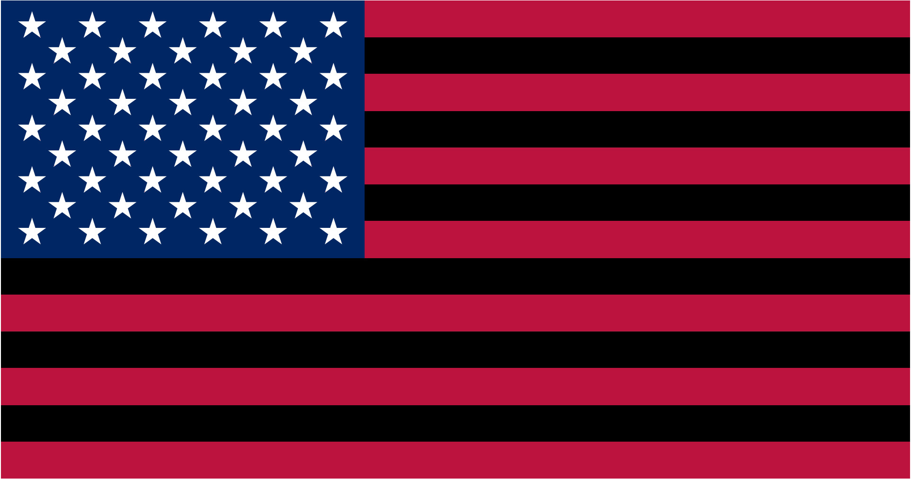
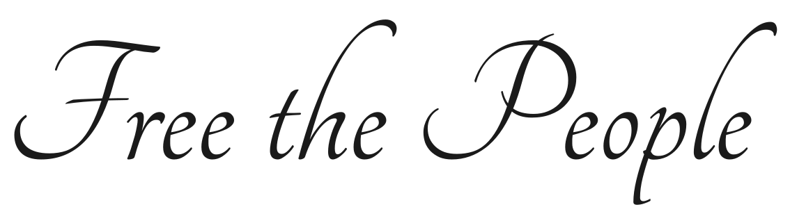
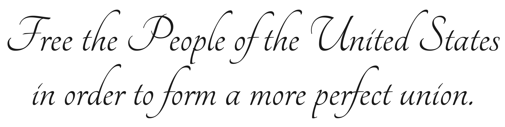

# free-the-people.us Public Assets

Assets in this repository are created and maintained by [free-the-people.us](https://free-the-people.us) to promote our cause. This repository contains official images, logos, icons, and other digital resources that have been designed by or approved by [free-the-people.us](https://free-the-people.us).

Assets are free to use and distribute as described in the [Creative Commons Attribution Share Alike 4.0 International](./license.txt) license.

## Logos

The official logo of [free-the-people.us](https://free-the-people.us) is shown below:

## Symbols

**[free-the-people.us](https://free-the-people.us) Protest Flag**

## Text as images

**Preamble (abridged):**

**Preamble (complete):**

